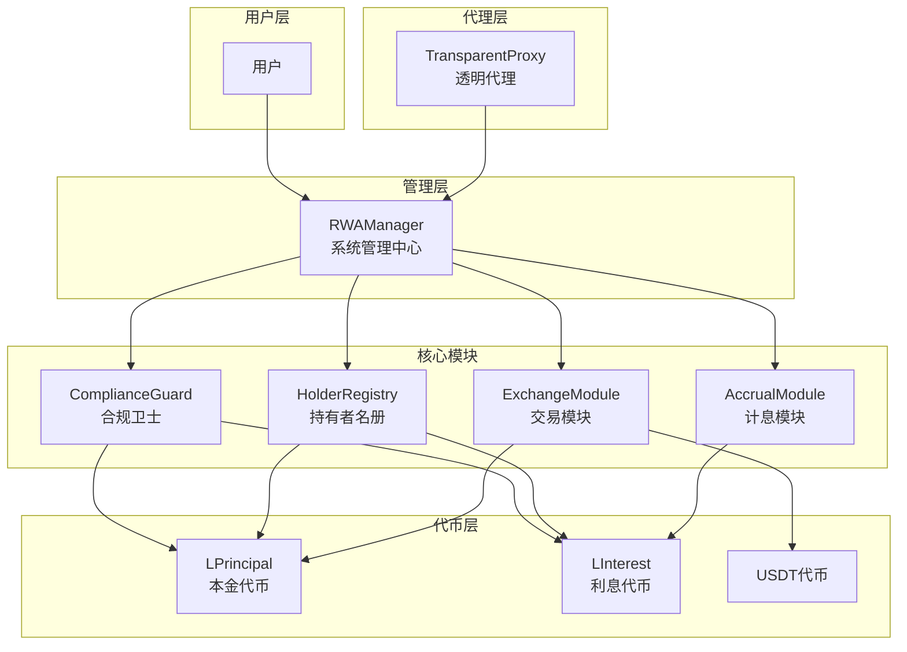
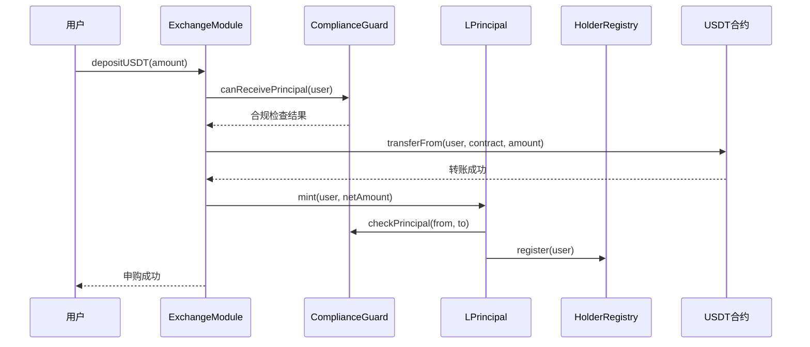
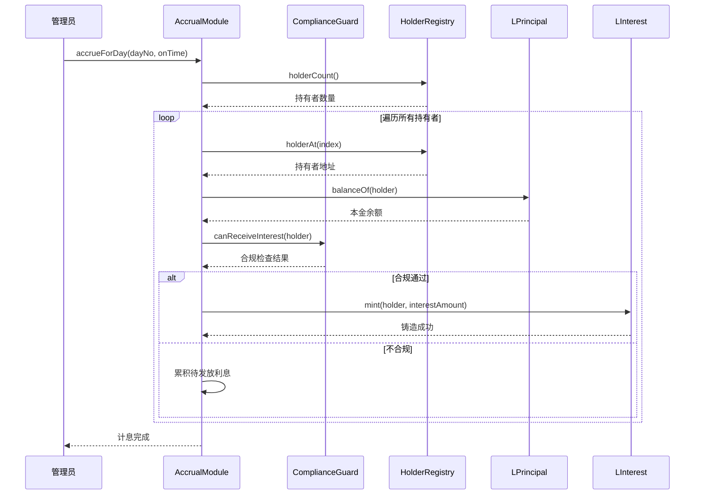
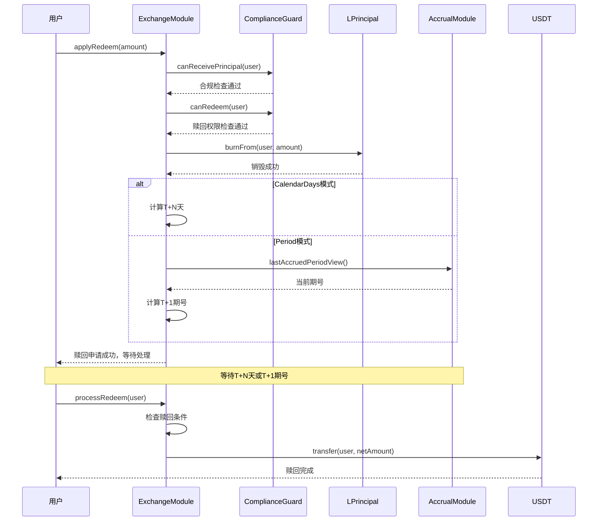
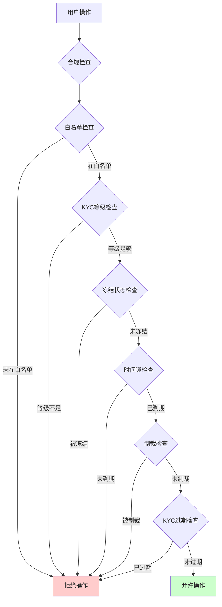
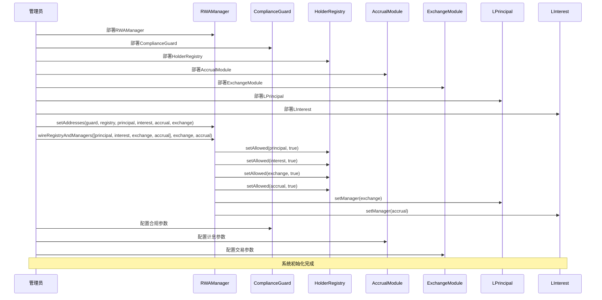
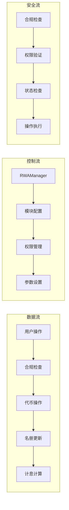

# RWA优化版本V11系统流程图

## 系统架构图

## 用户申购流程

## 计息流程

## 用户赎回流程

## 合规检查流程

## 系统初始化流程

## 模块间交互关系

## 关键特性说明

### 1. 模块化架构
- 每个模块职责单一，功能独立
- 通过接口进行模块间通信
- 支持模块独立升级和替换

### 2. 安全机制
- 多重权限验证
- 重入攻击防护
- 合规检查集成
- 资金安全保护

### 3. 可扩展性
- 代理模式支持合约升级
- 参数化配置支持业务调整
- 模块化设计支持功能扩展

### 4. 监管合规
- 完整的KYC/AML流程
- 多级权限控制
- 实时合规检查
- 审计友好的事件记录

这个流程图展示了RWA优化版本V11的完整系统架构和业务流程，包括用户操作、系统管理、合规检查、代币操作等各个环节的交互关系。
